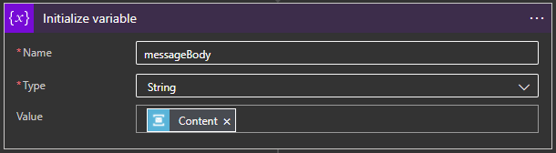

# Overview

This script will get the signed in users current "Presence" (as defined by Teams/Skype) and if that user is in a call, do some action

This particular "do some action" is to scroll a message across the LCD screen on an installed [Sense Hat](https://www.raspberrypi.org/products/sense-hat/)


# Prerequisites

1. First, install the required packages using `pip3 install requirements.txt`

    * Some users may have difficulty installing the `azure-servicebus` package.  This is often a result of non-native support for UAMQP on Raspbian.  Installing the packages called out in the [UAMQP pypi page](https://pypi.org/project/uamqp/) should resolve the issue

    * Alternatively, if you don't plan on setting up Azure infrastructure for supplying an email notification, simply remove azure-servicebus from requirements.txt. It is not needed in this case.

2. Register an AAD App, [using the steps outlined in this article](https://docs.microsoft.com/en-us/azure/active-directory/develop/quickstart-register-app#main)
    * Save the Client ID for the next step
    * Select "Mobile & Desktop Apps" under Platform Settings
    * Navigate to the "API Permissions" blade, click "Add a permission", and under "Microsoft Graph", find and select "Presence.Read", then click "Add permissions"

3. Update `Azure/config.json` with the `client_id` captured in step 2

Here is an example of how config.json should look (NOTE: If generating Azure infrastructure, `deployment_script.ps1` will automatically generate `email` and `sb_conn_string` attributes):
```
{
    "authority": "https://login.microsoftonline.com/common",
    "client_id": "00000000-1111-2222-3333-444444444444",
    "scope": ["Presence.Read"],
    "endpoint": "https://graph.microsoft.com/beta/me/presence",
    "email": "yourEmail@provider.com",
    "sb_conn_string": "Endpoint=sb://bus-name.servicebus.windows.net/;SharedAccessKeyName=yourKeyName;SharedAccessKey=yourBigLongComplicatedKey;EntityPath=yourQueueName"
}
```

# Authentication

If a valid user authentication token is not present in cache, one will need to be created. A couple options are available for this.

If the script is run manually on the intended device, it will open an authentication window in the default web browser and prompt the user to enter a code and sign in.  This will create an auth token that can automatically refresh for some time going forward.

If the user needs a method of being notified of an expired or invalid auth token without interfacing with their device, I propose the following solution:

* If no valid token, send a message to Azure Service Bus Queue.  
* Build a Logic App that listens to that Queue and sends an email to the address listed in config.json with the auth code required.

Templates for both of the required resources are included in this repo under the `Azure` folder. Configuration instructions are included further down this README.

# Configuring Re-Authentication Notifications

## DIY Method:

1. [Create a Service Bus Namespace and Queue](https://docs.microsoft.com/en-us/azure/service-bus-messaging/service-bus-quickstart-portal)
2. [Create a Logic App with Service Bus Trigger](https://docs.microsoft.com/en-us/azure/connectors/connectors-create-api-servicebus) (Follow steps in linked article UP TO "Add Service Bus Action" - you only need a service bus trigger, not the action)
3. [Add Initialize Variable Action](https://docs.microsoft.com/en-us/azure/logic-apps/logic-apps-create-variables-store-values#initialize-variable) with the following configuration:

4. [Add Parse JSON Action](https://docs.microsoft.com/en-us/azure/logic-apps/logic-apps-perform-data-operations#parse-json-action) with "Content" set to "variables('messageBody') and the following schema:
```
{
    "properties": {
        "email": {
            "type": "string"
        },
        "message": {
            "type": "string"
        },
        "user_code": {
            "type": "string"
        },
        "verification_uri": {
            "type": "string"
        }
    },
    "type": "object"
}

```
5. [Add a Send Email v2 Action](https://docs.microsoft.com/en-us/connectors/office365/#send-an-email-(v2)), and configure the To, Subject, and Body fields to your liking using the parsed JSON from the above activity.

## AzureRM Template Method
1. Install Azure Powershell with the following Powershell Script:
```
if ($PSVersionTable.PSEdition -eq 'Desktop' -and (Get-Module -Name AzureRM -ListAvailable)) {
    Write-Warning -Message ('Az module not installed. Having both the AzureRM and ' +
      'Az modules installed at the same time is not supported.')
} else {
    Install-Module -Name Az -AllowClobber -Scope CurrentUser
}
```
2. Run `Azure/deployment_script.ps1` from PowerShell
3. Enter your Azure credentials (login window may open behind all other windows)
4. This script will automatically create the following resources in your Azure subscription
    * An Azure Service Bus Namespace
    * A Queue on that Azure Service Bus named "authqueue"
    * An Azure Logic App, deployed with parameters specific to your account and the new Service Bus that was created
5. Log into Azure, open the Logic App editor for the newly created Logic App, and ensure that all connections are valid

# Sample crontab entry
```
* * * * * cd /home/pi/programs/GetTeamsPresence_console && /usr/bin/flock -n /tmp/presence.lockfile /home/pi/programs/GetTeamsPresence_console/bin/python3 /home/pi/programs/GetTeamsPresence_console/get_msgraph_presence.py
```

# Built With
* Python 3.7

# Authors
* **Patrick Lafferty** - [patrick.lafferty@slalom.com](mailto:patrick.lafferty@slalom.com)