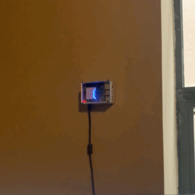

# Overview

This script will get the signed in users current "Presence" (as defined by Teams/Skype) and if that user is in a call, do some action

This particular "do some action" is to scroll a message across the LCD screen on an installed [Sense Hat](https://www.raspberrypi.org/products/sense-hat/)



# Prerequisites

1. First, install the required packages using `pip3 install requirements.txt`

    * Some users may have difficulty installing the `azure-servicebus` package.  This is often a result of non-native support for UAMQP on Raspbian.  Installing the packages called out in the [UAMQP pypi page](https://pypi.org/project/uamqp/) should resolve the issue.

    * Alternatively, if you don't plan on setting up Azure infrastructure for supplying an email notification, simply remove azure-servicebus from requirements.txt. It is not needed in this case.

2. Create a config.json file with the following structure, filling in the empty attributes (if you don't plan on setting up Azure infrastructure, remove `email` and `sb_conn_string`):
```
{
    "authority": "https://login.microsoftonline.com/common",
    "client_id": "",
    "scope": ["Presence.Read Presence.Read.All"],
    "endpoint": "https://graph.microsoft.com/beta/me/presence",
    "email": "",
    "sb_conn_string": ""
}
```

Here is an example:
```
{
    "authority": "https://login.microsoftonline.com/common",
    "client_id": "00000000-1111-2222-3333-444444444444",
    "scope": ["Presence.Read Presence.Read.All"],
    "endpoint": "https://graph.microsoft.com/beta/me/presence",
    "email": "yourEmail@provider.com",
    "sb_conn_string": "Endpoint=sb://bus-name.servicebus.windows.net/;SharedAccessKeyName=yourKeyName;SharedAccessKey=yourBigLongComplicatedKey;EntityPath=yourQueueName"
}
```

# Authentication

If a valid user authentication token is not present in cache, one will need to be created. A couple options are available for this.

If the script is run manually on the intended device, it will open an authentication window in the default web browser and prompt the user to enter a code and sign in.  This will create an auth token that can automatically refresh for some time going forward.

If the user needs a method of being notified of an expired or invalid auth token without interfacing with their device, I propose the following solution:

* If no valid token, send a message to Azure Service Bus Queue.  
* Build a Logic App that listens to that Queue and sends an email to the address listed in config.json with the auth code required.

Templates for both of the required resources are included in this repo under the `Azure` folder. Configuration instructions are included further down this README.

# Configuring Re-Authentication Notifications - 

## DIY Method:

1. [Create a Service Bus Namespace and Queue](https://docs.microsoft.com/en-us/azure/service-bus-messaging/service-bus-quickstart-portal)
2. [Create a Logic App with Service Bus Trigger](https://docs.microsoft.com/en-us/azure/connectors/connectors-create-api-servicebus) (Follow steps in linked article UP TO "Add Service Bus Action" - you only need a service bus trigger, not the action)
3. 

## AzureRM Template Method


# Built With
* Python 3.7

# Authors
* **Patrick Lafferty** - [patrick.lafferty@slalom.com](mailto:patrick.lafferty@slalom.com)